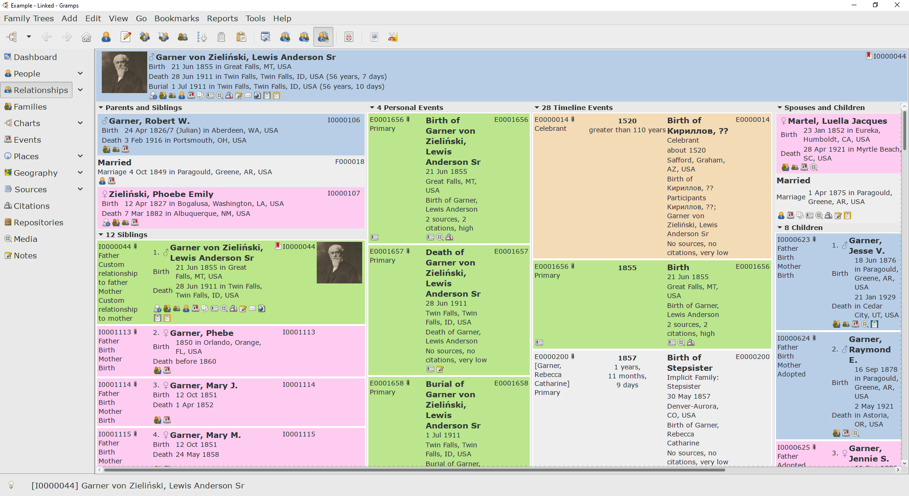
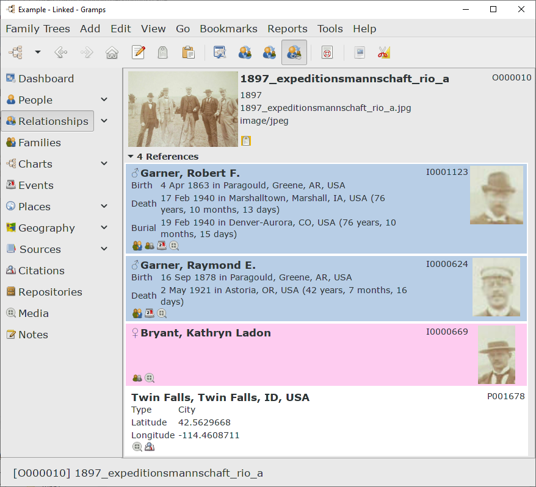
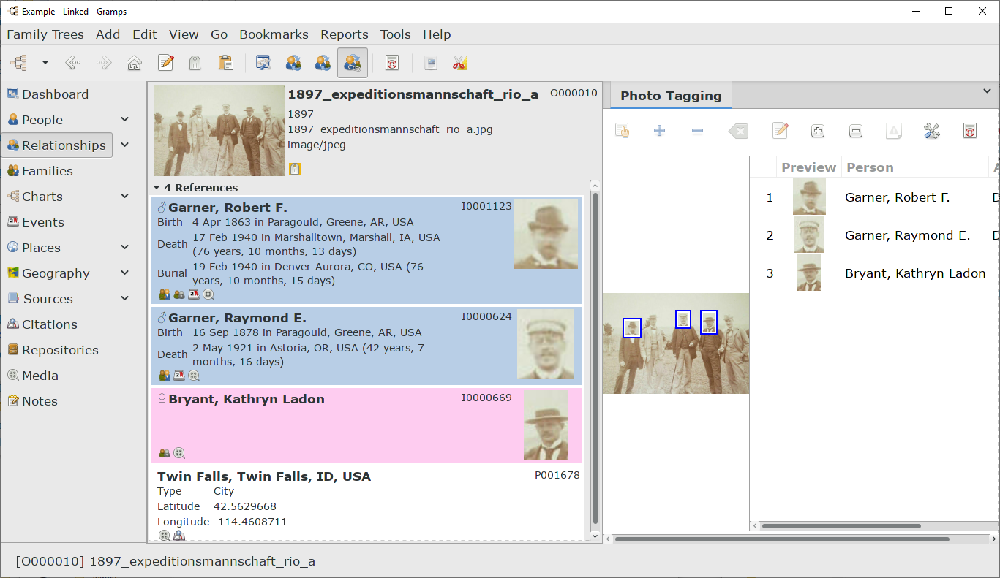

Linked View Plugin
===============
*a [third-party add-on](https://www.gramps-project.org/wiki/index.php/5.1_Addons#Addon_List) for the [Gramps](https://gramps-project.org) family of genealogy software* 

This is an *introductory* **ReadMe.md** document.  The [in-depth documentation](https://www.gramps-project.org/wiki/index.php/Addon:LinkedView) is perpetually in development on the [Gramps information portal](https://gramps-project.org/wiki/index.php/Portal:Using_Gramps),

This **LinkedView** plugin is an effort to provide an alternate interface that can be used to navigate through the data in a Gramps genealogy database. This Relationships category *view mode* is designed to give a broad perspective of how the data interlinks. 

It is largely influenced by the layout styles used by many online genealogy sites and is highly customizable. It was hoped that the **LinkedView** might provide an easier to navigate view for Gramps newcomers. Although during the evolution of the view mode, so many layers of functionalities to expose everything in the Gramps data model may have made it less of a navigation tool and more of an exploration tool.

This add-on is still in a development phase. But it is far enough along that it should be fairly usable.

HOWEVER, be sure to backup your tree regularly. Even better, use a different copy of your tree when exploring any of the add/edit/delete functionality.

> Note the view name (and thus, the ini file names) have changed. This was originally codenamed the **Profile View**. It has been renamed to **LinkedView** as that is more completely describes how it provides context of how data interlinks as it is navigated.

Installation
---------------

As a Gramps add-on, the **LinkedView** can be installed by creating a gramps/gramps51/plugins subdirectory ` of the [User Directory](https://gramps-project.org/wiki/index.php/Gramps_5.1_Wiki_Manual_-_User_Directory). (In Linux, the path would appears as follows: ~/.gramps/gramps51/plugins/LinkedView ) and then copying or cloning the full contents of this repository into place.

Usage Notes
---------------

At the present time, there are page views for each of the major categories of Gramps objects: Person, Family, Event, Place, Citation, Source, Repository, Media and Notes. Page views for most secondary objects have also been added: Child Reference, Association or Person Reference, Name, Address, Attribute, LDS Ordinance, Repository Reference and Tag. (Note that the **LinkedView** considers Tag a secondary object as, like other secondary objects, it is not trackable in the normal navigation history.)

Normally, the record at the top of the header frame is the active record for the category of objects. Note that for the Citation category page, the Source record is shown above the Citation record. Similarly for active records of the Families category, the primary parents shown above the basic Family data adds context.

It is important to note as you navigate you are switching focus across the different objects. Some Gramplets may only be designed to with specific objects or views and may have problems.  Different Navigation and History classes are used, derived from the ones used in the Combined View, so some behavior will be different from stock Gramps.

You can navigate using most of the titles of the framed objects which are links.  You can also left click on most of the viewable space on any frame where data is displayed to also switch to that object page.

Right-clicking on any frame will present possible actions in a pop-up contextual menu. Available actions will vary based on the context deriven from the object. So options for a header of the active person may differ from those for a parent or spouse or child or event or cited source. A large number of the actions are appropriate for all objects and so those context menus have these options in common.

Note in some contexts, such as children, the frame will contain two objects, the top level person object for the child and the child reference tracking their membership in a specific family. The action contextual pop-up menu for the reference object will contain operations that apply to the reference, not the primary object.

All configuration options and page layouts are handled in the same configuration dialog now.

The options for objects under active apply when the frame appears in the page header, those for objects under groups apply to those not in the page header.

For the layout configuration the default mode is single page, with various object groups beneath the header record. This is designed for large high resolution displays. You can configure which groups are visible and you can append one group on the bottom of another. There is also a tabbed mode selection which will be more similar though not exactly the same as in the Combined View. In that mode appending places groups side by side in the same tab.

Make note of the ability to customize the displayed data in most of the frames as well if you choose. For people you can choose which events, facts, and attributes to display as well as choose to display additional relationship calculations or other calculated fields. Note these user customizable field options are generally stored per tree as things like custom events or attributes may differ across trees.

 There is also a contextual configuration menu activated by a middle mouse click on any frame. This configuration menu will have options to take you to the particular configuration panel for the page or current object in the frame clicked on as well as some useful toggles to quickly enable or disable some of the features.
 

Some drag and drop functionality has been implemented. You can reorder children in a family, drag blocks of text from a browser page and drop it on an object to create a note, or drag the url for a page and drop it on an object that has url support to add it. Note that Firefox works fine but your mileage may vary with other browsers.

Most of the icon indicators that may appear at the bottom of a frame can be clicked to launch actions. A tag will take you to the tag page, a child object group will spawn a small view of that group of objects in a separate window, the todo indicator will bringup a popup you can use to navigate to a todo note, and so forth.

In the main toolbar the page copy option, next to the life boat buoy help icon, will spawn a full copy of the current page in a separate window as well.

Basic support has been added for interfacing with local Zotero clients if they have the [Better BibTex](https://retorque.re/zotero-better-bibtex/installation/) extension installed. This is largely one way support, allowing you to use the citation picker in the client and pulling the source and citation information into Gramps. For this to work reliably it is best if you use static citation keys, the key is stored in the Source record in the Zotero-key attribute. If it changes in Zotero then the next time you generate a Citation for Gramps it will not find the old Source and create a new one. Other attributes about the Source in Zotero are also imported and stored in the Source attributes. There is experimental support to import notes as well, but they are imported in raw html format. Note if you change source data in Zotero then the next time you generate a Citation for that Source it will update the Source with the changes on the Gramps side. 

Bug Reports and Feature Requests
---------------

At the present time, these kinds of feedback can be submitted on [Github](https://github.com/cdhorn/LinkedView). I am particulary interested in any ideas for alternate page layouts for objects. I am open to anything that might work better than what I have previously created.

History
---------------

This started as a Gramplet to learn about Gtk and toy around a bit. The framework provided by Nick Hall's [Combined View add-on](https://www.gramps-project.org/wiki/index.php/Addon:CombinedView) serves as the View Mode underpinnings -- although it has been extended to apply to all object types. Several other large pieces of code are also derived from the work of other Gramps developers to whom I am indebted.

*Enjoy!*, Christopher Horn